# ELK概述

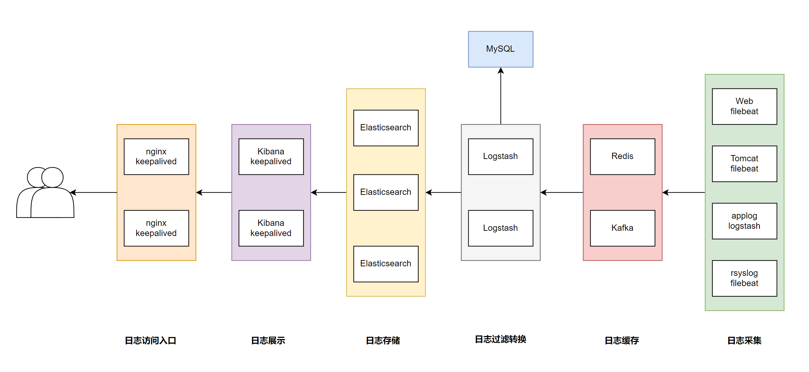

-   **Elasticsearch** 是一个实时的全文搜索,存储库和分析引擎。
-   **Logstash** 是数据处理的管道，能够同时从多个来源采集数据，转换数据，然后将数据发送到诸如 Elasticsearch 等存储库中。
-   **Kibana** 则可以让用户在 Elasticsearch 中使用图形和图表对数据进行可视化。

目前 Elastic Stack 中除了Elasticsearch、Logstash 和 Kibana, 还包括一系列丰富的轻量型数据采集代 理，这些代理统称为 **Beats**，可用来向 Elasticsearch 发送数据。

**ELK stack的主要优点：**

-   **功能强大**：Elasticsearch 是实时全文索引，具有强大的搜索功能
-   **配置相对简单**：Elasticsearch 全部其于 JSON，Logstash使用模块化配置，Kibana的配置都比较简单。
-   **检索性能高效**：基于优秀的设计，每次查询可以实时响应，即使百亿级数据的查询也能达到秒级响应。
-   **集群线性扩展**：Elasticsearch 和 Logstash都可以灵活线性扩展
-   **前端操作方便**：Kibana提供了比较美观UI前端，操作也比较简单

**EFK** 由**ElasticSearch**、**Fluentd**和**Kibana**三个开源工具组成。

**Fluentd**是一个实时开源的数据收集器,和logstash功能相似,这三款开源工具的组合为日志数据提供了分布式的实时搜集与分析的监控系统。

## Elasticsearch

### Elasticsearch 介绍

Elasticsearch 是一个分布式的免费开源搜索和分析引擎，适用于包括文本、数字、地理空间、结构化和 非结构化数据等在内的所有类型的数据。

### ELasticsearch原理

原始数据会从多个来源（包括日志、系统指标和网络应用程序）输入到 Elasticsearch 中。数据采集指在 Elasticsearch 中进行索引之前解析、标准化并充实这些原始数据的过程。这些数据在 Elasticsearch 中 索引完成之后，用户便可针对他们的数据运行复杂的查询，并使用聚合来检索自身数据的复杂汇总。

Elasticsearch 索引指**相互关联的文档集合**。Elasticsearch 会以 JSON 文档的形式存储数据。每个文档都会在一组键（字段或属性的名称）和它们对应的值（字符串、数字、布尔值、日期、数组、地理位置或 其他类型的数据）之间建立联系。

Elasticsearch 使用的是一种名为倒排索引的数据结构，这一结构的设计可以允许十分快速地进行全文本 搜索。倒排索引会列出在所有文档中出现的每个特有词汇，并且可以找到包含每个词汇的全部文档。

在索引过程中，Elasticsearch 会存储文档并构建倒排索引，这样用户便可以近乎实时地对文档数据进行 搜索。索引过程是在索引 API 中启动的，通过此 API 您既可向特定索引中添加 JSON 文档，也可更改特 定索引中的 JSON 文档

#### 基本概念

**Cluster 集群**

群集是一个或多个节点（服务器）的集合， 这些节点共同保存整个数据，并在所有节点上提供联合索引 和搜索功能。一个集群由一个唯一集群ID确定，并指定一个集群名（默认为“elasticsearch”）。该集群 名非常重要，因为节点可以通过这个集群名加入群集，一个节点只能是群集的一部分。

确保在不同的环境中不要使用相同的群集名称，否则可能会导致连接错误的群集节点。

**Node 节点**

节点是单个服务器实例，它是集群的一部分，可以存储数据，并参与群集的索引和搜索功能。就像一个 集群，节点的名称默认为一个随机的通用唯一标识符（UUID），确定在启动时分配给该节点。如果不希望默认，可以定义任何节点名。这个名字对管理很重要，目的是要确定网络服务器对应于ElasticSearch 群集节点。

我们可以通过集群名配置节点以连接特定的群集。默认情况下，每个节点设置加入名为“elasticSearch” 的集群。这意味着如果启动多个节点在网络上，假设他们能发现彼此都会自动形成和加入一个名为 “elasticsearch”的集群。

单个群集中，您可以拥有尽可能多的节点。此外，如果“elasticsearch”在同一个网络中，没有其他节 点正在运行，从单个节点的默认情况下会形成一个新的单节点名为"elasticsearch"的集群

**Index 索引**

索引是**具有相似特性的文档集合**。例如，可以为客户数据提供索引，为产品目录建立另一个索引，以及 为订单数据建立另一个索引。索引由名称**（必须全部为小写）**标识，该名称用于在对其中的文档执行索 引、搜索、更新和删除操作时引用索引。在单个群集中，您可以定义尽可能多的索引。

```
注意: 索引名不支持大写字母
```

**Document 文档**

文档是可以被索引的信息的基本单位。例如，您可以为单个客户提供一个文档，单个产品提供另一个文 档，以及单个订单提供另一个文档。本文件的表示形式为JSON（JavaScript Object Notation）格式，这 是一种非常普遍的互联网数据交换格式。

在索引/类型中，您可以存储尽可能多的文档。请注意，尽管文档物理驻留在索引中，**文档实际上必须索引**或分配到索引中的类型。

**Shards & Replicas 分片与副本**

索引可以存储大量的数据，这些数据可能超过单个节点的硬件限制。例如，十亿个文件占用磁盘空间 1TB的单指标可能不适合对单个节点的磁盘, 或者仅从单个节点的搜索请求服务可能太慢

为了解决这一问题，Elasticsearch提供细分指标分成多个块称为分片的能力。当创建一个索引，可以简 单地定义想要的分片数量。每个分片本身是一个全功能的、独立的“指数”，可以托管在集群中的任何节 点。

Shards分片的重要性主要体现在以下两个特征：

-   分片允许您水平拆分或缩放内容的大小
-   分片允许你分配和并行操作的碎片（可能在多个节点上）从而提高性能/吞吐量

在同一个集群网络或云环境上，故障是任何时候都会出现的，拥有一个故障转移机制以防分片和结点因 为某些原因离线或消失是非常有用的，并且被强烈推荐。为此，Elasticsearch允许你创建一个或多个拷 贝，索引分片进入所谓的副本或称作复制品的分片，简称Replicas。

注意：**ES的副本**指不包括主分片的其它副本,**即只包括备份**，这与Kafka是不同的

Replicas的重要性主要体现在以下两个特征：

-   副本为分片或节点失败提供了高可用性。需要注意的是，一个副本的分片不会分配在同一个节点作 为原始的或主分片，副本是从主分片那里复制过来的。
-   副本允许用户扩展你的搜索量或吞吐量，因为搜索可以在所有副本上并行执行。

## Logstash

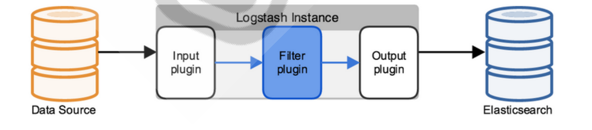

Logstash 是 Elastic Stack 的核心产品之一，可用来对数据进行聚合和处理，并将数据发送到 Elasticsearch。

Logstash 是一个基于Java实现的开源的服务器端数据处理管道，允许您在将数据索引到 Elasticsearch 之前同时从多个来源采集数据，并对数据进行过滤和转换。

可以通过插件实现日志收集和转发，支持日志过滤，支持普通log、自定义json格式的日志解析。

## Kibana

Kibana 是一款适用于 Elasticsearch 的**基于Javascript语言**实现的数据可视化和管理工具，可以提供实时的直方图、线形图、饼状图和地图。Kibana 同时还包括诸如 Canvas 和 Elastic Maps 等高级应用程序； Canvas 允许用户基于自身数据创建定制的动态信息图表，而 Elastic Maps 则可用来对地理空间数据进行可视化。

# Elasticsearch 部署和管理

**部署方式**

-   **包安装**
-   **二进制安装**
-   **Docker 部署**
-   **Kubernetes 部署**
-   **Ansible 批量部署**

**ES支持操作系统版本和 Java 版本官方说明**

[支持一览表 | Elastic](https://www.elastic.co/cn/support/matrix)

## ELasticsearch安装前准备

### 安装前环境初始化

```shell
CPU 2C
内存4G或更多
操作系统: Ubuntu22.04,Ubuntu20.04,Ubuntu18.04,Rocky8.X,Centos 7.X
操作系统盘50G
主机名设置规则为nodeX.wang.org
生产环境建议准备单独的数据磁盘
```

主机名

```shell
#各服务器配置自己的主机名
hostnamectl set-hostname es-node1
```

各服务器配置本地域名解析

```shell
vim /etc/hosts
10.0.0.222 es-node1
10.0.0.223 es-node2
10.0.0.224 es-node3
```

内核参数 `vm.max_map_count` 用于限制一个进程可以拥有的VMA(虚拟内存区域)的数量

```shell
echo "vm.max_map_count = 262144" >> /etc/sysctl.conf
# 系统最大打开的文件描述符数 fs.file-max 大于1000000
# echo "fs.file-max = 1000000" >> /etc/sysctl.conf
sysctl -p
```

关于JDK环境说明

```bash
1.x 2.x 5.x 6.x都没有集成JDK的安装包，也就是需要自己安装java环境
7.x 版本的安装包分为带JDK和不带JDK两种包，带JDK的包在安装时不需要再安装java，如果不带JDK的包
仍然需要自己去安装java
8.X 版本内置JDK，不再支持自行安装的JDK
```

## Elasticsearch 安装

### 包安装

```shell
wget https://artifacts.elastic.co/downloads/elasticsearch/elasticsearch-8.17.3-amd64.deb
sudo dpkg -i elasticsearch-8.17.3-amd64.deb
```

重置生成新密码

```shell
# 方法1：生成随机密码
/usr/share/elasticsearch/bin/elasticsearch password -u elastic

# 方法2：交互式生成指定密码
/usr/share/elasticsearch/bin/elasticsearch-reset-password --username elastic -i
```

在实际生产中，Elasticsearch会不可避免的和各种其他服务进行通信，这个过程中该认证会产生很多麻烦，所以在内网安全可到保证的情况下，建议把该安全加固取消

```shell
vim /etc/elasticsearch/elasticsearch.yml
xpack.security.enabled: false

vim /etc/elasticsearch/jvm.options
-Xms1g
-Xmx1g
```


### 二进制安装Elasticsearch

```shell
wget https://artifacts.elastic.co/downloads/elasticsearch/elasticsearch-8.17.3-linux-x86_64.tar.gz
wget https://artifacts.elastic.co/downloads/elasticsearch/elasticsearch-8.17.3-linux-x86_64.tar.gz.sha512
shasum -a 512 -c elasticsearch-8.17.3-linux-x86_64.tar.gz.sha512 
tar -xf elasticsearch-8.17.3-linux-x86_64.tar.gz
cd elasticsearch-8.17.3/ 
mv elasticsearch-8.17.3 /usr/local/
ln -s /usr/local/elasticsearch-8.17.3 /usr/local/elasticsearch
```

**编辑服务配置文件（集群配置）**

```shell
vim /usr/local/elasticsearch/config/elasticsearch.yml
# 关闭安全功能
xpack.security.enabled: false
# 改数据和日志目录
path.data: /usr/local/elasticsearch/data/es-data
path.logs: /usr/local/elasticsearch/data/es-logs
http.host: 0.0.0.0 
network.host: 0.0.0.0 
```

**修改ELK内存配置**

修改ELK内存配置，推荐使用宿主机物理内存的一半，最大不超过30G

```
vim /usr/local/elasticsearch/config/jvm.options
-Xms1g
-Xmx1g
```

**创建用户**

从ES7.X以后版不允许以root启动服务，需要委创建专用的用户

```shell
useradd -r elasticsearch
```

**目录权限更改**

在所有节点上创建数据和日志目录并修改目录权限为elasticsearch

```shell
chown -R elasticsearch:elasticsearch /usr/local/elasticsearch/
```

**创建service文件**

```shell
vim /lib/systemd/system/elasticsearch.service
[Unit]
Description=Elasticsearch
Documentation=http://www.elastic.co
Wants=network-online.target
After=network-online.target

[Service]
RuntimeDirectory=elasticsearch
PrivateTmp=true
Environment=PID_DIR=/var/run/elasticsearch
WorkingDirectory=/usr/local/elasticsearch
User=elasticsearch
Group=elasticsearch
ExecStart=/usr/local/elasticsearch/bin/elasticsearch -p ${PID_DIR}/elasticsearch.pid --quiet
# StandardOutput is configured to redirect to journalctl since
# some error messages may be logged in standard output before
# elasticsearch logging system is initialized. Elasticsearch
# stores its logs in /var/log/elasticsearch and does not use
# journalctl by default. If you also want to enable journalctl
# logging, you can simply remove the "quiet" option from ExecStart.
# Specifies the maximum file descriptor number that can be opened by this process
LimitNOFILE=65535
# Specifies the maximum number of processes
LimitNPROC=4096
# Specifies the maximum size of virtual memory
LimitAS=infinity
# Specifies the maximum file size
LimitFSIZE=infinity
# Disable timeout logic and wait until process is stopped
TimeoutStopSec=0
# SIGTERM signal is used to stop the Java process
KillSignal=SIGTERM
# Send the signal only to the JVM rather than its control group
KillMode=process
# Java process is never killed
SendSIGKILL=no
# When a JVM receives a SIGTERM signal it exits with code 143
SuccessExitStatus=143

[Install]
WantedBy=multi-user.target

systemctl daemon-reload
```

**启动ELasticsearch服务**

```shell
systemctl start elasticsearch.service 
```

## 多节点集群部署

此方式需要3G以上内存，否则会出现OOM报错

修改内核参数

```shell
echo vm.max_map_count=262144 >> /etc/sysctl.conf
sysctl -p
```

9200端口：用于web访问
9300端口：用于集群内nodes之间通信

集群配置

```shell
cluster.name: my-application #指定集群名称，同一个集群内的所有节点相同
node.name: node-1            #修改此行，每个节点不同

# 集群模式必须修改此行，默认是127.0.0.1:9300,否则集群节点无法通过9300端口通信，每个节点相同
network.host: 0.0.0.0     
# 用于发现集群内节点地址
discovery.seed_hosts: ["10.0.0.222", "10.0.0.223", "10.0.0.224"] 
# 指定允许参与主节点选举的nodes
cluster.initial_master_nodes: ["10.0.0.222", "10.0.0.223", "10.0.0.224"]

# 下面这行和上面的相同，将其注释掉防止冲突
# cluster.initial_master_nodes: ["ubuntu2204.wang.org"]     #将此行注释
```

```shell
systemctl restart elasticsearch

curl 10.0.0.222:9200/_cat/nodes
```

## Elasticsearch 集群扩容和缩容

### 集群扩容

新节点

```shell
vim /etc/elasticsearch/elasticsearch
cluster.name: my-application #和原集群名称相同
node.name: node4  #第二个新节点为node5
network.host: 0.0.0.0
#指定任意集群节点即可
discovery.seed_hosts: ["10.0.0.222","10.0.0.223","10.0.0.224"]
# 以下配置（选配）
# ELasticsearch8.x开始，使用新方式指定节点角色
# 如果是master节点
node.roles: [master]
# 如果是Data节点
node.roles: [data]
# 如果节点同时是 Master 和 Data 节点：
node.roles: [master, data]
# 如果节点是 Coordinating-only 节点（不存储数据也不当选主节点，仅用于查询分发）
#如果改为路由节点，需要先执行/usr/share/elasticsearch/bin/elasticsearch-node repurpose 清理数据
node.roles: []

systemctl restart elasticsearch.service
```

### 集群缩容

从集群中删除两个节点node4和node5，在两个节点按一定的顺序逐个停止服务，即可自动退出集群

注意：停止服务前，要观察索引的情况，按一定顺序关机，防止数据丢失

就是要注意：同一个节点上，不能有相同的分片
停服务的时候，要注意保证先把该节点上独有的分片，复制到其他集群节点上后，在删除该节点

**缺点关停的节点上的主分片在其他节点上有副本。**

节点一个个关停，要等待集群内的分片不缺少，

比如分片1的主分片与副本都在node3与node5上，就不能同时关停3，5.否则数据会缺失

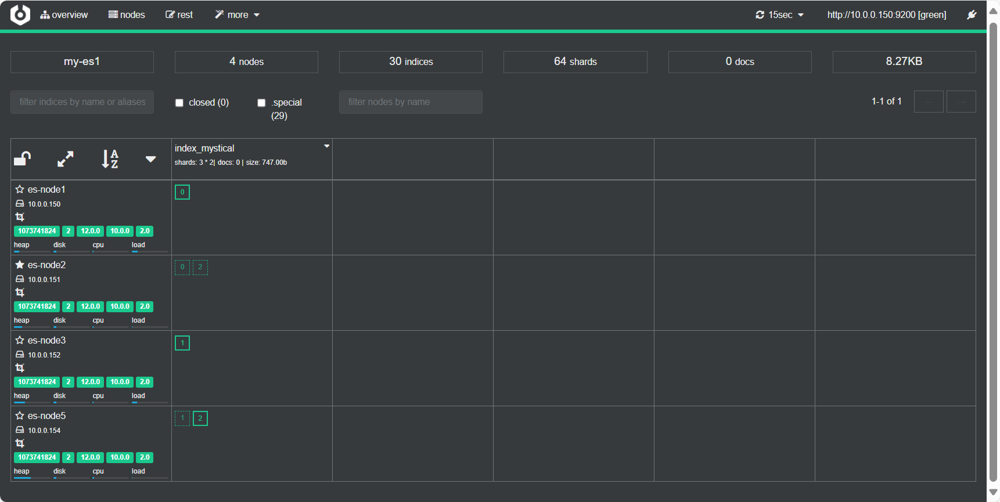

## 优化ELK资源配置

### 预留充足的内存空间

**开启 bootstrap.memory_lock: true 可以优化性能，但会导致无法启动的错误解决方法**

开启 `bootstrap.memory_lock: true` 需要足够的内存，建议4G以上，否则内存不足，启动会很失败或很慢

作用：用于在启动前给`Elasticsearch`预留充足的内存空间

```shell
# 开启此功能建议堆内存大小设置是总内存的一半，也就是内存充足的情况下使用
vim /etc/elasticsearch/elasticsearch.yml
#开启此功能导8.X致集群模式无法启动,但单机模式可以启动
bootstrap.memory_lock: true

# 8.X致集群模式需要修改如下配置
[Service]
#加下面一行
LimitMEMLOCK=infinity
```

### 内存优化

**推荐使用宿主机物理内存的一半，ES的heap内存最大不超过30G,26G是比较安全的**

为了保证性能，每个ES节点的JVM内存设置具体要根据 node 要存储的数据量来估算,建议符合下面约定

-   在内存和数据量有一个建议的比例：对于一般日志类文件，1G 内存能存储**48G~96GB**数据
-   JVM 堆内存最大不要超过30GB
-   单个分片控制在30-50GB，太大查询会比较慢，索引恢复和更新时间越长；分片太小，会导致索引 碎片化越严重，性能也会下降

```shell
# 范例
#假设总数据量为1TB，3个node节点，1个副本；那么实际要存储的大小为2TB
每个节点需要存储的数据量为:2TB / 3 = 700GB，每个节点还需要预留20%的空间，所以每个node要存储大约 700*100/80=875GB 的数据；每个节点按照内存与存储数据的比率计算：875GB/48GB=18，即需要JVM内存为18GB,小于30GB
因为要尽量控制分片的大小为30GB；875GB/30GB=30个分片,即最多每个节点有30个分片

#思考：假设总数据量为2TB，3个node节点，1个副本呢？
```

### **修改service文件，做优化配置**

```shell
[root@es-node1 ~]# vim /usr/lib/systemd/system/elasticsearch.service 
LimitNOFILE=1000000       #修改最大打开的文件数，默认值为65535
LimitNPROC=65535          #修改打开最大的进程数，默认值为4096
LimitMEMLOCK=infinity     
```

## Elasticsearch面板

### Head插件

浏览器安装插件

```shell
https://www.mysticalrecluse.com/script/tools/ElasticSearch-Head-0.1.5_0.zip
```

浏览器中导入插件

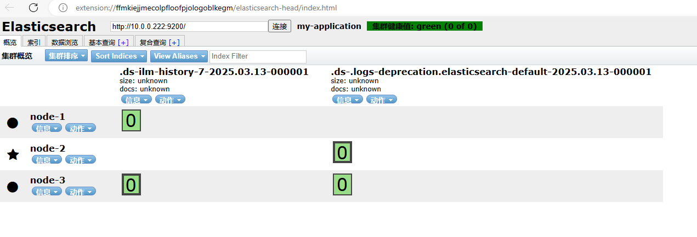

### Cerebro插件

[lmenezes/cerebro](https://github.com/lmenezes/cerebro)

cerebro needs Java 11 or newer to run.

```shell
apt install openjdk-11-jdk
wget https://github.com/lmenezes/cerebro/releases/download/v0.9.4/cerebro_0.9.4_all.deb
dpkg -i cerebro_0.9.4_all.deb

vim /etc/cerebro/application.conf
# Path of local database file
data.path: "/var/lib/cerebro/cerebro.db"                                                
#data.path = "./cerebro.db"

systemctl start cerebro.service

# 默认监听9000端口
# 访问浏览器：10.0.0.132:9000,并输入es集群IP连接
```

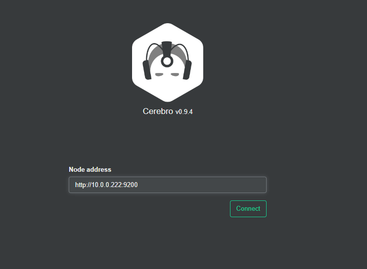

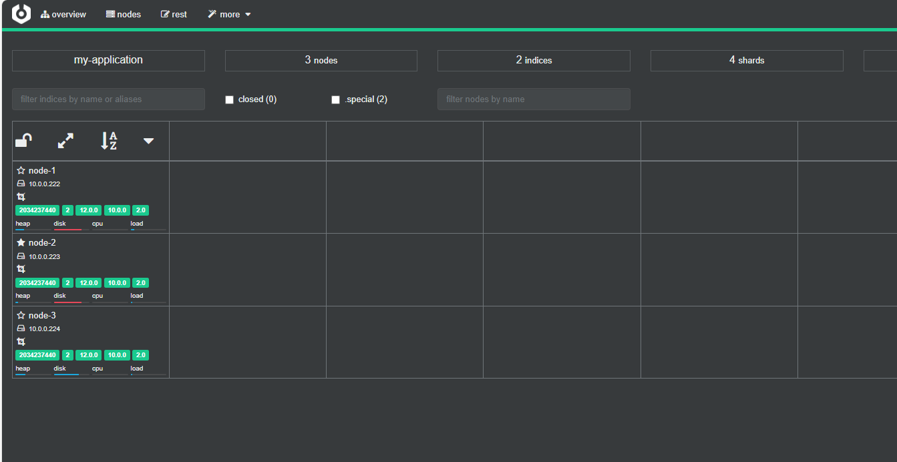

## ELasticsearch API访问

**可以用三种方式和 Elasticsearch进行交互**

-   **curl 命令**和其它浏览器: 基于命令行,操作不方便
-   **插件**: 在node节点上安装head,Cerebro 等插件,实现图形操作,查看数据方便
-   **Kibana**: 需要java环境并配置,图形操作,显示格式丰富

### 查看ES集群状态

```shell
# 查看支持的指令
curl http://127.0.0.1:9200/_cat

#查看es集群状态，?v是详细显示 ?human是可阅读显示
curl http://127.0.0.1:9200/_cat/health

#查看集群健康性
curl http://127.0.0.1:9200/_cluster/health?pretty=true

#查看所有的节点信息
curl 'http://127.0.0.1:9200/_cat/nodes?v'

#列出所有的索引 以及每个索引的相关信息
curl 'http://127.0.0.1:9200/_cat/indices?v'
```

### 创建，查看，删除索引

```shell
#创建索引index1
curl -XPUT '127.0.0.1:9200/index1'
# 默认会自动生成一个副本

# 副本丢失会，再次创建副本
# 颜色含义：
# 绿色：完全健康
# 黄色：副本丢了，数据没丢
# 红色：数据丢失

# 因为少于半数以上可用，即3个节点的集群，关了两个，因此集群不可用，es无法访问

#创建索引index2,格式化输出
curl -XPUT '127.0.0.1:9200/index2?pretty'
#查看所有索引
curl 'http://127.0.0.1:9200/_cat/indices?v'
# 查看索引格式化输出
curl 'http://127.0.0.1:9200/index1?pretty'
```

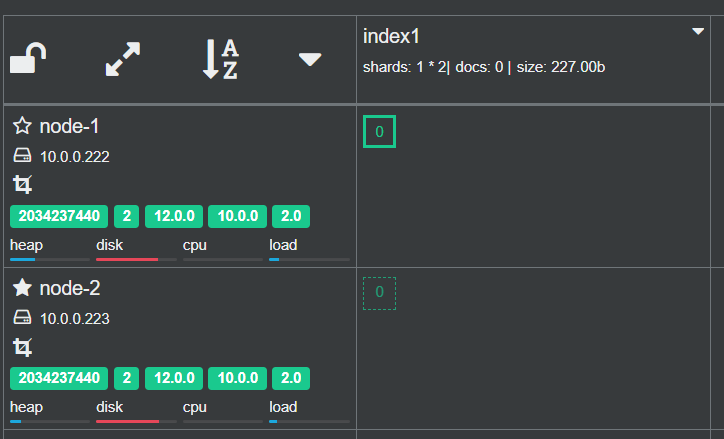

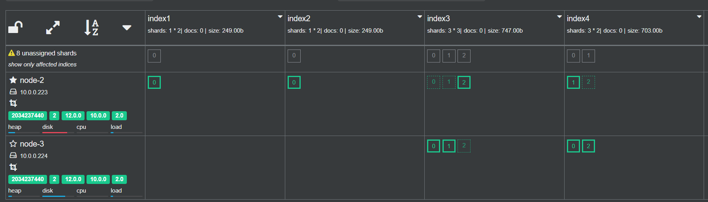

```shell
# 创建3个分片和2个副本的索引
curl -XPUT '127.0.0.1:9200/index3' -H 'Content-Type: application/json' -d '
{                     
  "settings": {
    "index": {
      "number_of_shards": 3,  
      "number_of_replicas": 2
   }                         
 }
}'

# 创建3分片，1副本（生产中建议分片数和节点数相同，实现负载均衡）
curl -XPUT '127.0.0.1:9200/index4' -H 'Content-Type: application/json' -d '
{                     
  "settings": {
    "index": {
      "number_of_shards": 3,  
      "number_of_replicas": 1
   }                         
 }
}'
# ES自动将分片数据均匀的放在不同节点上，实现高可用
```


```shell
curl -XDELETE http://127.0.0.1:9200/index2

# 删除所有索引
vim /etc/elasticsearch/elasticsearch.yml
action.destructive_requires_name: false

curl -X DELETE "http://127.0.0.1:9200/*"

# 也可以不开启action.destructive_requires_name，使用循环进行批量删除
for i in `curl 'http://127.0.0.1:9200/_cat/indices?v'|awk '{print $3}'`;do curl -XDELETE http://127.0.0.1:9200/$i;done
```

### doc 文档操作

```shell
#创建文档时不指定_id，会自动生成
#8.X版本后因为删除了type,所以索引操作：{index}/{type}/需要修改成{index}/_doc/
#8.X版本之后

curl -XPOST http://127.0.0.1:9200/index0/_doc/ -H 'Content-Type: application/json' -d '{"name":"linux", "author": "ll", "version": "1.0"}'

# 指定id，插入文档（通常是系统分配）
curl -XPOST 'http://127.0.0.1:9200/index0/_doc/3?pretty' -H 'Content-Type: application/json' -d '{"name":"golang", "author": "ll", "version": "1.0"}' 
```

查询文档

```shell
# 所有文档
curl 'http://127.0.0.1:9200/index0/_search?pretty'

# 指定ID
curl 'http://127.0.0.1:9200/index0/_doc/3?pretty'
```

更新文档

```shell
curl -XPOST 'http://127.0.0.1:9200/index0/_doc/3' -H 'Content-Type: application/json' -d '{"version": "2.0","name":"golang","author": "ll"}'
```

删除文档

```shell
curl -XDELETE 'http://127.0.0.1:9200/index1/_doc/3'
```

# ELasticsearch集群工作原理

单机节点 ES 存在单点可用性和性能问题,可以实现Elasticsearch多机的集群解决

Elasticsearch 支持集群模式

-   能够提高Elasticsearch可用性，即使部分节点停止服务，整个集群依然可以正常服务
-   能够增大Elasticsearch的性能和容量，如内存、磁盘，使得Elasticsearch集群可以支持PB级的数据

## 节点

### ES 节点分类

*   **Master节点**
    *   ES集群中只有一个 Master 节点，用于**控制**和**管理**整个集群的操作
    *   Master 节点负责**增删索引**,**增删节点**,**分片shard的重新分配**
    *   Master 主要维护**Cluster State**，包括节点名称,节点连接地址,索引名称和配置信息等
    *   Master 接受集群状态的变化并推送给所有其它节点,集群中各节点都有一份完整的集群状态信息， 都由master node负责维护
    *   Master 节点**不需要**涉及到**文档级别**的变更和搜索等操作
    *   协调创建索引请求或查询请求，将请求分发到相关的node上。
    *   当Cluster State有新数据产生后， Master 会将数据同步给其他 Node 节点
    *   Master节点通过超过一半的节点投票选举产生的
    *   可以设置node.master: true 指定为是否参与Master节点选举, 默认true
*   **Data节点**
    *   存储数据的节点即为 data 节点
    *   当创建索引后，索引的数据会存储至某个数据节点
    *   Data 节点消耗内存和磁盘IO的性能比较大
    *   配置node.data: true, 就是Data节点，默认为 true,**即默认所有节点都是 Data 节点类型**
*   **Ingest 节点**
    *   如果集群中有大量数据预处理需求（如日志解析、字段提取等），可以引入专门的 Ingest 节点。 功能类似logstash
    *   将 Ingest 节点与 Data 节点分离，避免数据预处理影响数据存储和查询性能
    *   负责数据预处理（如管道处理、数据转换等）
    *   Ingest 节点的基础原理是：节点接收到数据之后，根据请求参数中指定的管道流 id，找到对应的已 注册管道流，对数据进行处理，然后将处理过后的数据，按照 Elasticsearch 标准的 indexing 流程 继续运行。

*   **Coordinating 节点(协调)**
    *   处理请求的节点即为 coordinating 节点，该节点类型为所有节点的默认角色，不能取消coordinating 节点。主要将请求路由到正确的节点处理。比如创建索引的请求会由 coordinating 路由到 master 节点处理
    *   这可以减轻 Data 节点的负载，提高查询性能。
    *   当配置 node.master:false、node.data:false 则只充当 Coordinating 节点
    *   Coordinating 节点在 Cerebro 等插件中数据页面不会显示出来
*   **Machine Learning 节点**
    *   负责机器学习任务（如异常检测等）。
    *   如果使用 Elasticsearch 的机器学习功能，可以配置专门的 Machine Learning 节点。
    *   这些节点需要较高的 CPU 和内存资源。
    *   需要 enable x-pack

*   **Master-eligible 初始化时有资格选举Master的节点**
    *   集群初始化时有权利参于选举Master角色的节点
    *   只在集群第一次初始化时进行设置有效，后续配置无效
    *   由 cluster.initial_master_nodes 配置节点地址

### 节点规划

单一职责的节点: 一个节点只承担一个角色

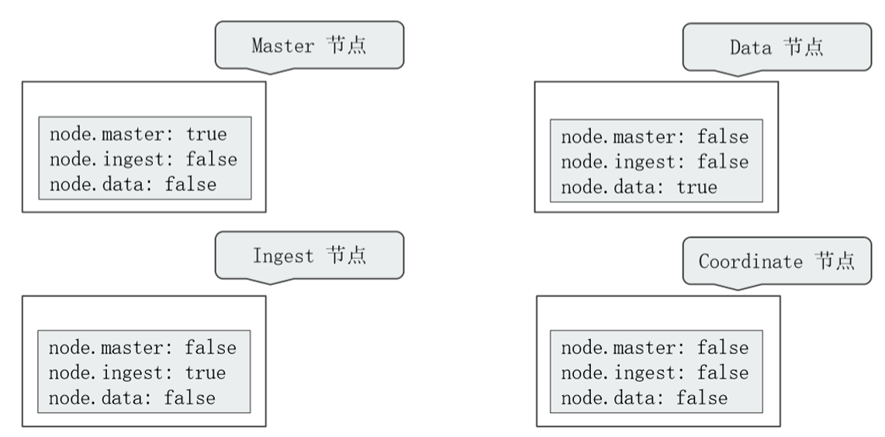

*   Dedicated master nodes：负责集群状态（cluster state）的管理
    *   从高可用 & 避免脑裂的角色出发,一般在生产环境中配置 3 台,一个集群只有 1 台活跃的主节点 使用低配置的 CPU ,RAM 和磁盘
*   Dedicated data nodes: 负责数据存储及处理客户端请求
    *   使用高配置的 CPU,RAM 和磁盘
*   Dedicated ingest nodes: 负责数据处理
    *   使用高配置的 CPU ; 中等配置的 RAM; 低配置的磁盘
*   Dedicate Coordinating Only Node (Client Node)
    *   配置：将 Master ，Data ，Ingest 都配置成 Flase
    *   生产环境中，建议为一些大的集群配置 Coordinating Only Nodes,扮演 Load Balancers。 降低  Master 和 Data Nodes 的负载
    *   负载搜索结果的 Gather / Reduce有时候无法预知客户端会发生怎样的请求大量占用内存的结合操 作，一个深度聚合可能引发 OOM

### 节点架构

当磁盘容量无法满足需求时，可以增加数据节点；磁盘读写压力大时，增加数据节点


当系统中有大量的复杂查询及聚合时候，增加 Coordinating 节点，增加查询的性能

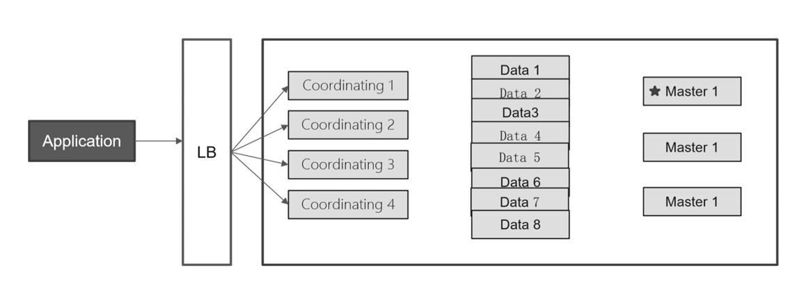

读写分离

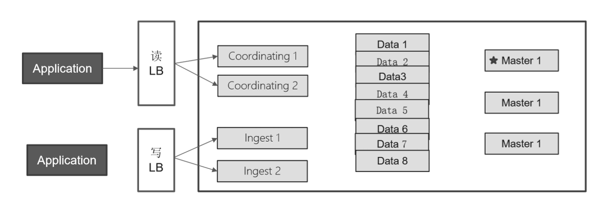

## ES集群选举

选举时,优先选举**ClusterStateVersion**最大的Node节点，如果ClusterStateVersion相同，则选举**Node ID**最小的Node

ClusterStateVersion 是集群状态的版本号，每当集群状态发生变更时（例如节点加入、索引创建、分片重新分配等），版本号都会递增。因此，这个版本号越大，说明是越早加入集群的，里面的数据越多

**Node的ID**是在第一次服务启动时随机生成的，直接选用最小ID的Node，主要是为了选举的稳定性，尽量少出现选举不出来的问题。

```shell
curl -XGET "http://10.0.0.222:9200/_cluster/state/version?pretty"
{
  "cluster_name" : "my-application",
  "cluster_uuid" : "o5dy5KnXTLqYi5nxANWaZw",
  "version" : 222, # ClusterStateVersion
  "state_uuid" : "_U7QTJ_PSwezxZyl2NWMdg"
}

curl -XGET "http://10.0.0.222:9200/_cat/nodes?v&h=ip,name,id"
ip         name   id
10.0.0.223 node-2 vaWX
10.0.0.224 node-3 8r4D
10.0.0.222 node-1 wkhV
```


## ES 集群 Shard 和 Replication

### 分片 Shard

ES 中存储的数据可能会很大,有时会达到PB级别，单节点的容量和性能可以无法满足

基于容量和性能等原因,可以将一个索引数据分割成多个小的分片

再将每个分片分布至不同的节点,从而实现数据的分布存储,实现性能和容量的水平扩展

在读取时,可以实现多节点的并行读取,提升性能

除此之外,如果一个分片的主机宕机,也不影响其它节点分片的读取

横向扩展即增加服务器，当有新的Node节点加入到集群中时，集群会动态的重新进行均匀分配和负载

例如原来有两个Node节点，每个节点上有3个分片，即共6个分片,如果再添加一个node节点到集群中，
集群会动态的将此6个分片分配到这三个节点上，最终每个节点上有2个分片。

### 副本 Replication

将一个索引分成多个数据分片,仍然存在数据的单点问题,可以对每一个分片进行复制生成副本,即备份,实现数据的高可用

ES的分片分为主分片（primary shard）和副本分片（复制replica shard），而且通常分布在不同节点

**主分片实现数据读写,副本分片只支持读**

在索引中的每个分片只有一个主分片,而对应的副本分片可以有多个,一个副本本质上就是一个主分片的备份

每个分片的主分片在创建索引时自动指定且后续不能人为更改

**默认分片配置**

默认情况下，elasticsearch将分片相关的配置从配置文件中的属性移除了，可以借助于一个默认的模板接口将索引的分片属性更改成我们想要的分片效果

```shell
curl -XPUT 'http://127.0.0.1:9200/_template/template_http_request_record' -H 'Content-Type: application/json' -d '{"index_patterns": ["*"],"settings": {"number_of_shards": 5,"number_of_replicas": 1}}'

#属性解析：
接口地址：_template/template_http_request_record
索引类型：index_patterns
分片数量：number_of_shards
副本数量：number_of_replicas
```

## 数据同步机制

Elasticsearch主要依赖 **Zen Discovery 协议**来管理集群中节点的加入和离开，以及选举主节点（master node）。

Zen Discovery是Elasticsearch自带的一个协议，不依赖于任何外部服务。

然而，Elasticsearch对于一致性的处理与传统的一致性协议（如Raft或Paxos）有所不同。它采取了一 种“**最终一致性**”（eventual consistency）的模型。

每个索引在Elasticsearch中被分成多个分片（shard），每个分片都有一个主分片和零个或多个副本分片。

主分片负责处理所有的写操作，并将写操作复制到其副本分片。当主分片失败时，一个副本分片会被提升为新的主分片

Elasticsearch为了提高写操作的性能，允许在主分片写入数据后立即确认写操作，而不需要等待数据被所有副本分片确认写入。这就意味着，在某些情况下，主分片可能会确认写操作成功，而实际上副本分片还没有完全写入数据。这就可能导致数据在短时间内在主分片和副本分片之间不一致。然而，一旦所 有副本分片都确认写入了数据，那么系统就会达到“最终一致性”。

为了保证搜索的准确性，Elasticsearch还引入了一个**"refresh"机制**，每隔一定时间（默认为1秒）将最新的数据加载到内存中，使其可以被搜索到。这个过程是在主分片和所有副本分片上独立进行的，所以可能存在在短时间内搜索结果在不同分片之间有些许不一致的情况，但随着时间的推移，所有分片上的数据都会达到一致状态。

## 集群故障转移

故障转移指的是，当集群中有节点发生故障时，ES集群会进行自动修复

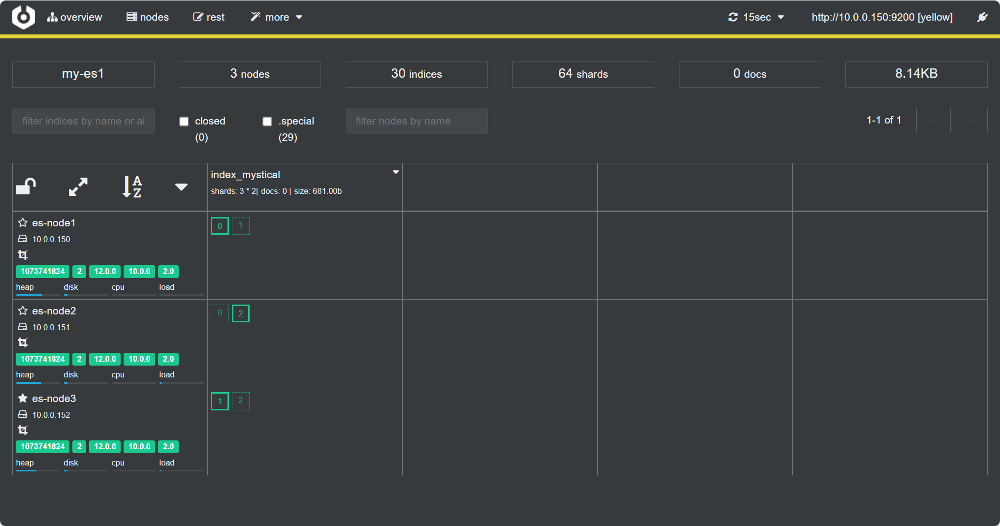

**ES集群的故障转移流程如下**

-   重新选举
    -   假设当前Master节点 node3 节点宕机,同时也导致 node3 的原有的P1和R2分片丢失
    -   node1 和 node2 发现 Master节点 node3 无法响应
    -   过一段时间后会重新发起 master 选举
    -   比如这次选择 node2 为 新 master 节点；此时集群状态变为yellow 状态
    -   其实无论选举出的新Master节点是哪个节点，都不影响后续的分片的重新分布结果

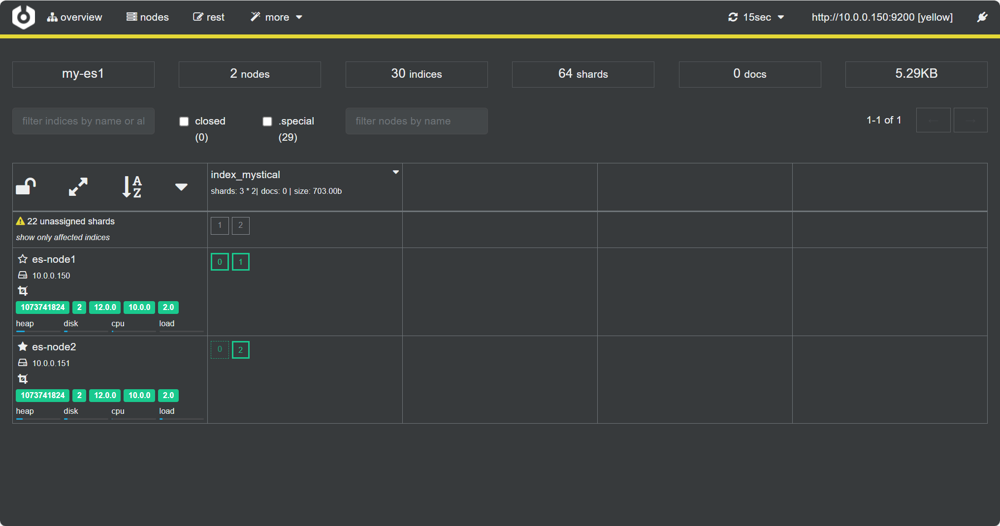

-   主分片调整
    -   新的Master节点 node2 发现在原来在node3上的主分片 P1 丢失
    -   将 node1 上的 R1 提升为主分片
    -   此时所有的主分片都正常分配，但1和2分片没有副本分片
    -   集群状态变为 Yellow状态
-   副本分片调整
    -   node1 将 P1 和 node2上的P2 主分片重新生成新的副本分片 R1、R2，此时集群状态变为 Green

-   后续修复好node3节点后，Master 不会重新选举，但会自动将各个分片重新均匀分配
    -   保证主分片尽可能分布在每个节点上
    -   副本分片也尽可能分布不同的节点上
    -   重新分配的过程需要一段时间才能完成

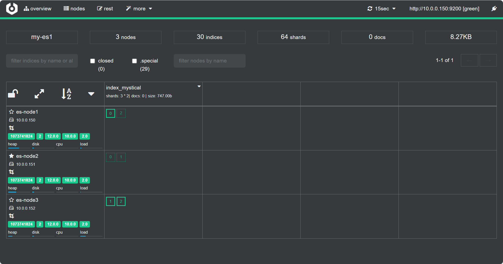

## ES文档路由

ES文档是分布式存储，当在ES集群访问或存储一个文档时，由下面的算法决定此**文档到底存放在哪个主分片中**,再结合**集群状态**找到存放此主分片的节点主机

```shell
shard = hash(routing) % number_of_primary_shards
hash                     #哈希算法可以保证将数据均匀分散在分片中
routing                  #用于指定用于hash计算的一个可变参数，默认是文档id，也可以自定义
number_of_primary_shards #主分片数
# 注意：该算法与主分片数相关，一旦确定后便不能更改主分片，因为主分片数的变化会导致所有分片需要重新分配
# 先根据哈希/主分片数计算出要存放到几号分片中，存放到主分片后，再将数据复制到副本分片中
```

**ES 文档创建删除流程**

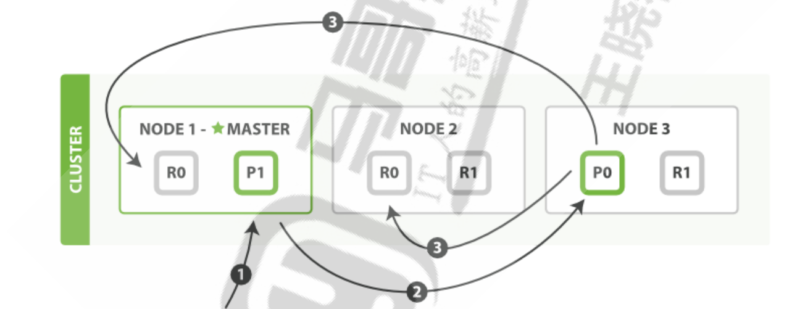

-   客户端向集群中某个节点 Node1 发送**新建索引文档**或者**删除索引文档**请求
-   Node1节点使用文档的 _id 通过上面的算法确定文档属于分片 0
-   因为分片 0 的主分片目前被分配在 Node3 上,请求会被转发到 Node3
-   Node3 在主分片上面执行创建或删除请求
-   Node3 执行如果成功，它将请求并行转发到 Node1 和 Node2 的副本分片上
-   Node3 将向协调节点Node1 报告成功
-   协调节点Node1 客户端报告成功。

**ES 文档读取流程**

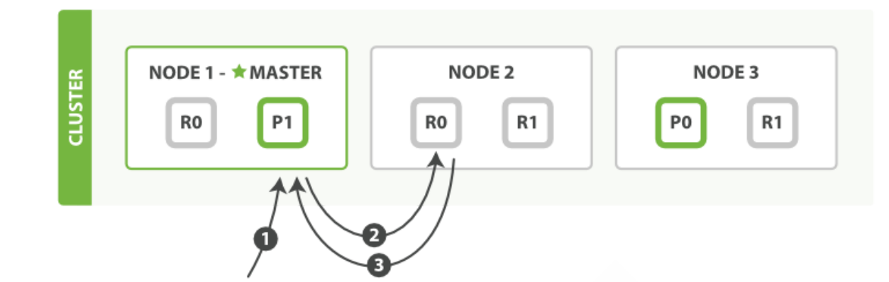

-   客户端向集群中某个节点 Node1 发送读取请求
-   节点使用文档的 _id 来确定文档属于分片 0 。分片 0 的主副本分片存在于所有的三个节点上
-   在处理读取请求时，协调节点在每次请求的时候都会通过轮询所有的主副本分片来达到负载均衡， 此次它将请求转发到 Node2
-   Node2 将文档返回给 Node1 ，然后将文档返回给客户端

# Beats收集数据

Beats 是一个免费且开放的平台，集合了多种单一用途数据采集器。它们从成百上千或成千上万台机器 和系统向 Logstash 或 Elasticsearch 发送数据。 

虽然利用 logstash 就可以收集日志，功能强大，但由于 Logstash 是基于Java实现，需要在采集日志的 主机上安装JAVA环境

ogstash运行时最少也会需要额外的**500M的以上的内存**，会消耗比较多的内存和磁盘空间， 可以采有基于Go开发的 Beat 工具代替 Logstash 收集日志，部署更为方便，而且只占用**10M左右的内 存空间**及更小的磁盘空间。

[Beats: Data Shippers for Elasticsearch | Elastic](https://www.elastic.co/beats)

[elastic/beats: :tropical_fish: Beats - Lightweight shippers for Elasticsearch & Logstash](https://github.com/elastic/beats)

 Beats 是一些工具集,包括以下,其中 filebeat 应用最为广泛


```shell
filebeat:收集日志文件数据。最常用的工具
packetbeat:用于收集网络数据。一般用zabbix实现此功能
metricbeat:从OS和服务收集指标数据，比如系统运行状态、CPU 内存利用率等。
winlogbeat: 从Windows平台日志收集工具。
heartbeat: 定时探测服务是否可用。支持ICMP、TCP 和 HTTP，也支持TLS、身份验证和代理
auditbeat:收集审计日志
Functionbeat:使用无服务器基础架构提供云数据。面向云端数据的无服务器采集器，处理云数据
```

| Beat                                                         | Description                                                  |
| ------------------------------------------------------------ | ------------------------------------------------------------ |
| [Auditbeat](https://github.com/elastic/beats/tree/main/auditbeat) | Collect your Linux audit framework data and monitor the integrity of your files. |
| [Filebeat](https://github.com/elastic/beats/tree/main/filebeat) | Tails and ships log files                                    |
| [Heartbeat](https://github.com/elastic/beats/tree/main/heartbeat) | Ping remote services for availability                        |
| [Metricbeat](https://github.com/elastic/beats/tree/main/metricbeat) | Fetches sets of metrics from the operating system and services |
| [Packetbeat](https://github.com/elastic/beats/tree/main/packetbeat) | Monitors the network and applications by sniffing packets    |
| [Winlogbeat](https://github.com/elastic/beats/tree/main/winlogbeat) | Fetches and ships Windows Event logs                         |
| [Osquerybeat](https://github.com/elastic/beats/tree/main/x-pack/osquerybeat) | Runs Osquery and manages interraction with it.               |

**Beats 版本要和 Elasticsearch 相同的版本，否则可能会出错**

## 利用 Metricbeat 监控性能相关指标

Metricbeat 可以收集指标数据，比如系统运行状态、CPU、内存利用率等。 

生产中一般用 zabbix 等专门的监控系统实现此功能


# Kibana图形显示

Kibana 是一款开源的数据分析和可视化平台，它是 Elastic Stack 成员之一，设计用于和 Elasticsearch 协作,可以使用 Kibana 对 Elasticsearch 索引中的数据进行搜索、查看、交互操作,您可以很方便的利用 图表、表格及地图对数据进行多元化的分析和呈现。

Kibana 可以使大数据通俗易懂。基于浏览器的界面便于您快速创建和分享动态数据仪表板来追踪 Elasticsearch 的实时数据变化。

## 安装并配置 Kibana

可以通过包或者二进制的方式进行安装,可以安装在独立服务器,或者也可以和elasticsearch的主机安装在 一起

[elastic/kibana: Your window into the Elastic Stack](https://github.com/elastic/kibana)

### 包安装

基于性能原因，建议将Kibana安装到独立节点上，而非和ES节点复用

```shell
wget https://artifacts.elastic.co/downloads/kibana/kibana-8.17.3-amd64.deb
sudo dpkg -i kibana-8.17.3-amd64.deb
useradd -r -s /sbin/nologin kibana
```

配置

```shell
vim /etc/kibana/kibana.yml
server.port: 5601  #监听端口,此为默认值
server.host: "0.0.0.0" #修改此行的监听地址,默认为localhost，即：127.0.0.1:5601

#修改此行,指向ES任意服务器地址或多个节点地址实现容错,默认为localhost
elasticsearch.hosts: ["http://10.0.0.222:9200","http://10.0.0.223:9200","http://10.0.0.224:9200"] 

i18n.locale: "zh-CN"   #修改此行,使用"zh-CN"显示中文界面,默认英文

#8.X版本新添加配置,默认被注释,会显示下面提示
server.publicBaseUrl: "http://kibana.loong.com"

systemctl start kibana.service
```

磁盘空间不足，elastic不会接收新的分片。

**检查磁盘水位**

查看 `node-2` 和 `node-3` 的磁盘使用情况：

```shell
curl -X GET "http://localhost:9200/_cat/allocation?v"
```

如果 `node` 的 `disk.percent` 接近 85%，Elasticsearch 可能不会分配副本给 `node-2`。

 **解决方法**： 增加磁盘水位阈值：

```shell
curl -X PUT "http://localhost:9200/_cluster/settings" -H "Content-Type: application/json" -d'
{
  "persistent": {
    "cluster.routing.allocation.disk.watermark.low": "95%",
    "cluster.routing.allocation.disk.watermark.high": "97%",
    "cluster.routing.allocation.disk.watermark.flood_stage": "98%",
    "cluster.info.update.interval": "1m"
  }
}'
```

然后再尝试分片分配：

```shell
curl -XPOST "http://localhost:9200/_cluster/reroute?pretty"
```

## 使用 Kibana

### 连接ES

#### Kibana 8.X 开启xpack.security功能连接ES

```shell
#在ES节点上生成token
/usr/share/elasticsearch/bin/elasticsearch-create-enrollment-token --scope kibana
123456

#查看 verification code
systemctl status kibana.service
Your verification code is:  201 867
```

浏览器访问,填写上面的token


填写code


#### Kibana 8.X 禁用xpack.security功能连接ES

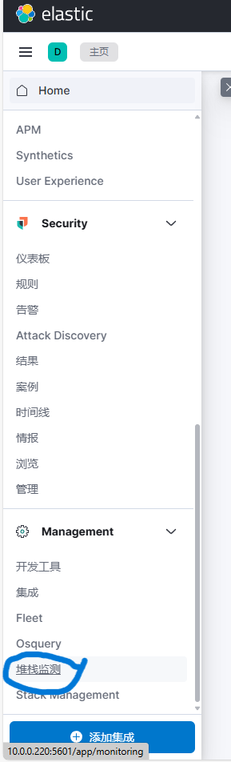


### 管理索引

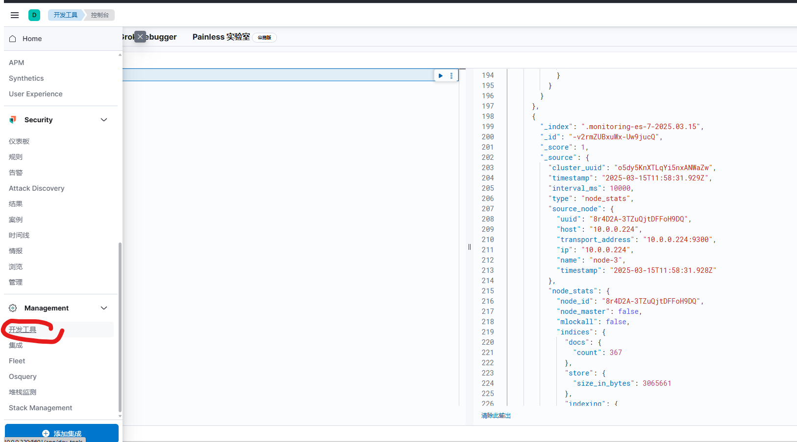

```shell
GET _search

GET _search 
{ 
    "query":{
        "match_all":{}
    }
}
```


创建索引并创建doc

```shell
POST /index_wang/_doc/1
{
    "username": "wang",
    "age": 18,
    "title": "cto"
}

# 查看
GET /index_wang/_doc/1
```

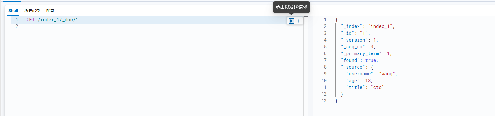


